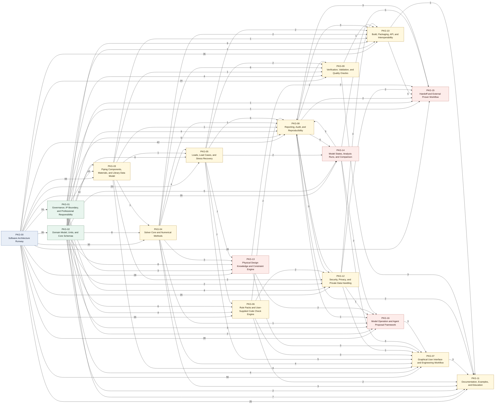

# DAG-002 Mermaid Visualization

## Boundary

This file visualizes the approved `DAG-002` revision `0.5` active edge set.
It does not compute blocker readiness, refresh deliverable-local dependency
mirrors, change lifecycle state, dispatch Type 2 work, run `PREPARATION`, or
promote Chirality corpus material.

The package graph below collapses the 859 approved active deliverable edges
into cross-package dependency counts. Edge direction is upstream package to
dependent package, matching the approved dependency direction where
`FromDeliverableID` depends on `TargetDeliverableID`.

Candidate rows are excluded from these diagrams. The 8 candidate rows remain
non-gating, and the 1 retired proposal row is not part of the approved active
edge set.

## Graph Facts

| Fact | State |
|---|---:|
| Packages represented | 17 |
| Deliverable nodes | 92 |
| Approved active edges | 859 |
| Cross-package active edges | 764 |
| Internal same-package active edges | 95 |
| Non-gating candidate rows | 8 |
| Retired proposal row | 1 |
| Active SCCs | 0 |
| Active topological waves | 15 |

## Package-Level View

## Wave-Level View

```mermaid
flowchart LR
  W01["Wave 1<br/>8 deliverables<br/>PKG-00:8"]
  W02["Wave 2<br/>2 deliverables<br/>PKG-01:1, PKG-02:1"]
  W03["Wave 3<br/>4 deliverables<br/>PKG-01:2, PKG-02:2"]
  W04["Wave 4<br/>7 deliverables<br/>PKG-01:1, PKG-02:2, PKG-04:1, PKG-05:1, PKG-06:1, PKG-13:1"]
  W05["Wave 5<br/>12 deliverables<br/>PKG-03:2, PKG-04:2, PKG-06:3, PKG-10:1, PKG-11:1, PKG-12:1, PKG-13:1, PKG-16:1"]
  W06["Wave 6<br/>17 deliverables<br/>PKG-03:6, PKG-04:2, PKG-05:1, PKG-06:1, PKG-07:2, PKG-08:1, PKG-11:1, PKG-12:2, PKG-13:1"]
  W07["Wave 7<br/>12 deliverables<br/>PKG-04:1, PKG-05:2, PKG-07:3, PKG-08:1, PKG-09:1, PKG-10:1, PKG-12:1, PKG-13:1, PKG-14:1"]
  W08["Wave 8<br/>2 deliverables<br/>PKG-05:1, PKG-09:1"]
  W09["Wave 9<br/>6 deliverables<br/>PKG-07:1, PKG-08:2, PKG-09:1, PKG-10:1, PKG-11:1"]
  W10["Wave 10<br/>7 deliverables<br/>PKG-07:1, PKG-08:1, PKG-09:1, PKG-10:1, PKG-11:1, PKG-12:1, PKG-14:1"]
  W11["Wave 11<br/>4 deliverables<br/>PKG-09:1, PKG-11:1, PKG-14:1, PKG-15:1"]
  W12["Wave 12<br/>4 deliverables<br/>PKG-10:1, PKG-14:2, PKG-15:1"]
  W13["Wave 13<br/>2 deliverables<br/>PKG-15:1, PKG-16:1"]
  W14["Wave 14<br/>2 deliverables<br/>PKG-15:1, PKG-16:1"]
  W15["Wave 15<br/>3 deliverables<br/>PKG-07:1, PKG-08:1, PKG-16:1"]
  W01 --> W02
  W02 --> W03
  W03 --> W04
  W04 --> W05
  W05 --> W06
  W06 --> W07
  W07 --> W08
  W08 --> W09
  W09 --> W10
  W10 --> W11
  W11 --> W12
  W12 --> W13
  W13 --> W14
  W14 --> W15
  classDef wave fill:#eef4ff,stroke:#5277a3,stroke-width:1px,color:#172033;
  class W01,W02,W03,W04,W05,W06,W07,W08,W09,W10,W11,W12,W13,W14,W15 wave;
```

## Internal Same-Package Active Edges

| Package | Internal active edges |
|---|---:|
| `PKG-01` | 4 |
| `PKG-02` | 8 |
| `PKG-03` | 8 |
| `PKG-04` | 8 |
| `PKG-05` | 5 |
| `PKG-06` | 5 |
| `PKG-07` | 10 |
| `PKG-08` | 8 |
| `PKG-09` | 6 |
| `PKG-10` | 4 |
| `PKG-12` | 6 |
| `PKG-13` | 6 |
| `PKG-14` | 7 |
| `PKG-15` | 6 |
| `PKG-16` | 4 |

## Notes

- `PKG-00` architecture-basis edges dominate the package view because every
  non-`PKG-00` package receives applicable architecture context.
- `PKG-13` through `PKG-16` are revision `0.5` additions and are highlighted
  in the package diagram.
- The wave diagram is dependency-order evidence only. It is not schedule,
  staffing, priority, readiness, or dispatch authority.
